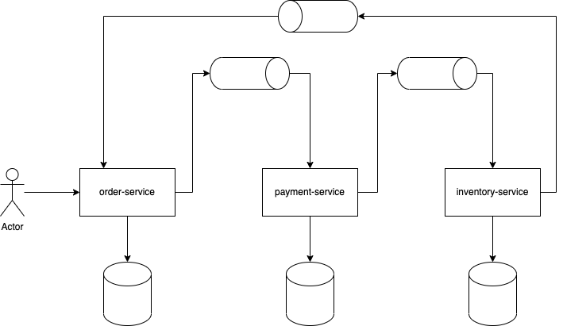

# Learning SAGA

A saga is a sequence of local transactions. Each local transaction updates the database and publishes a message or event to trigger the next local transaction in the saga. If a local transaction fails because it violates a business rule then the saga executes a series of compensating transactions that undo the changes that were made by the preceding local transactions.

Exists two types of implmentations

## Choreography
The choreography-based saga pattern is an implementation where is no centrelized point of control. Every service notify when finish the transaction to the next one to do it local transaction. When something goes wrong, this services who `fail` needs to notify the compensation event to rollback the previous local transactions.

This is the model that I implemented to learn more about on the `choreography-based` folder.

## Orchestrator

_TODO_

---
## References
- https://microservices.io/patterns/data/saga.html
- https://medium.com/javarevisited/distributed-transaction-management-in-microservices-part-2-saga-pattern-53808a55e641 